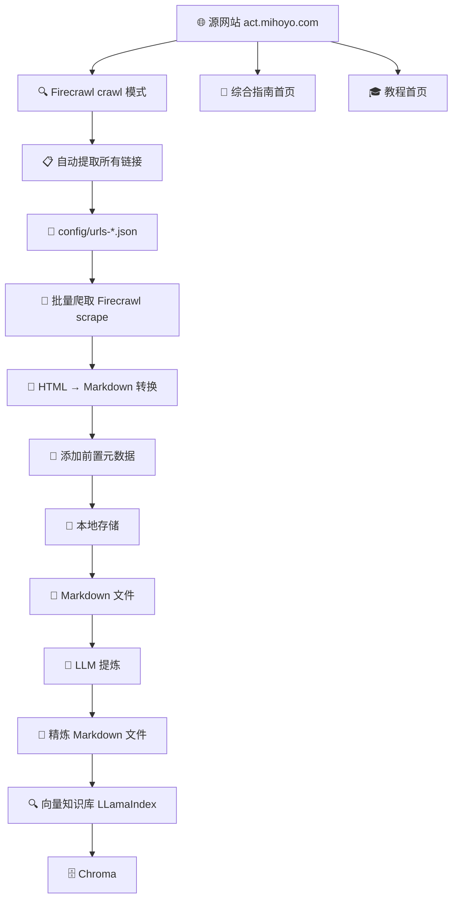

# 🕷️ 知识库爬虫脚本

> 基于 Firecrawl API 的自动化文档爬取和 Markdown 生成工具

## 📁 项目结构

```
knowledge/
├── 📄 README.md                    # 本文档
├── 📦 package.json                 # 依赖配置
├── ⚙️  tsconfig.json               # TypeScript 配置
├── 🔐 .env.local                   # 环境变量配置
├── 🧹 cleaner/                     # 知识库提炼
├── 🔍 rag/                          # LLamaIndex 项目代码，用于生成知识库（向量）
├── 🕷️ spider/                      # 核心脚本
│   ├── 🚀 crawl.ts                 # 自动爬取 URL 列表
│   ├── 📥 scrape.ts                # 主爬虫脚本
│   ├── 📝 types.ts                 # 类型定义
│   └── 🛠️  utils/                   # 工具模块
│       └── 🔥 firecrawl.ts         # Firecrawl 集成
├── ⚙️  config/                      # 配置文件
│   ├── 📋 urls-group.json          # 综合指南 URL 列表
│   └── 📚 urls-tutorial.json       # 教程 URL 列表
```

## 🏗️ 架构设计



## 🕷️ Spider 爬虫模块

本模块负责管理文档爬取，实现从网页抓取到 Markdown 文件生成的完整流程。

### 📖 源页面
- **综合指南**: https://act.mihoyo.com/ys/ugc/tutorial/detail/mh29wpicgvh0
- **教程**: https://act.mihoyo.com/ys/ugc/tutorial/course/detail/mhhw2l08o6qo

### ✨ 核心功能

- ✅ **自动 URL 提取** - 使用 Firecrawl crawl 模式自动发现所有文档链接
- ✅ **批量爬取** - 支持并发爬取（默认并发度=2），带进度报告和错误处理
- ✅ **Markdown 生成** - 自动生成带前置元数据的 Markdown 文件

---

## 🚀 快速开始

### 1️⃣ 安装依赖

```bash
cd knowledge
npm install
```

### 2️⃣ 配置环境变量

```bash
# 创建环境变量文件
cp .env.example .env.local
```

编辑 `.env.local`：

```bash
# Firecrawl API
FIRECRAWL_API_KEY=your-firecrawl-key
```

### 3️⃣ 生成 URL 列表

```bash
# 爬取综合指南 URL
npm run crawl -- --type=group

# 爬取教程 URL
npm run crawl -- --type=tutorial

# 爬取所有 URL（默认）
npm run crawl
```

### 4️⃣ 执行爬取

```bash
# 完整爬取（默认并发度=2 符合 free plan 的并行度）
npm run scrape

# 测试模式（只处理前 5 个文档，避免消耗大量 API 额度）
npm run scrape -- --test

# 指定测试数量
npm run scrape -- --test --limit=10

# 自定义并发度
npm run scrape -- --concurrency=3

# 强制重新爬取（覆盖已存在的文件）
npm run scrape -- --force
```

---

## 📝 生成的 Markdown 格式

每个生成的 Markdown 文件都包含完整的前置元数据：

```markdown
---
id: doc-xxx
title: 文档标题
url: https://...
sourceURL: https://...
description: 描述
language: zh
scope: tutorial
crawledAt: 2025-10-28T...
---

# 文档内容...
```

---
